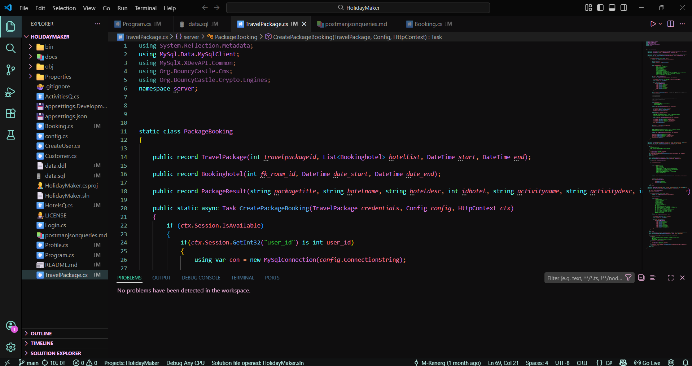

# Chill Night Mode 🌙

A dark mode theme crafted for comfort. 

I created this theme after experimenting with various color palettes to find the perfect balance. The goal was a background that isn't too harsh and syntax highlighting that is easy to read and gentle on the eyes during long sessions.

## Features
* **Eye-Care Background:** A deep, balanced dark tone that reduces eye strain.
* **Readable Syntax:** Carefully selected colors for high legibility.
* **Minimalist Aesthetic:** Designed to keep you focused on your code.

## Preview

## Feedback
If you enjoy using Chill Night Mode, please consider leaving a rating!